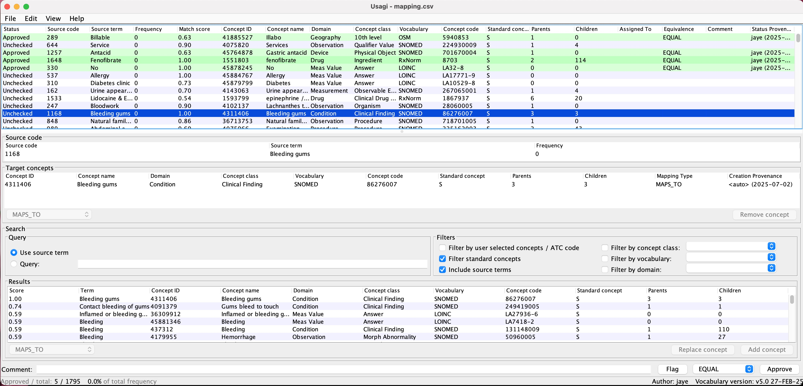
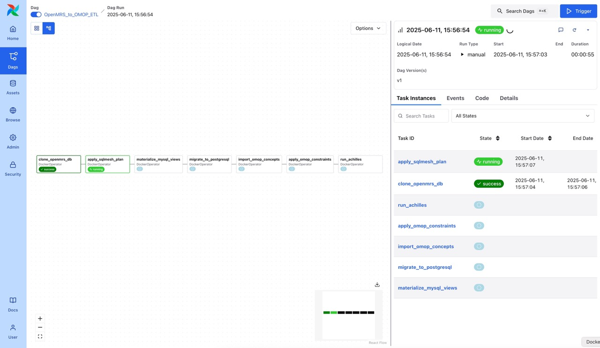

## 🏗️  Setting Up Git LFS for This Repository

This repository uses **Git Large File Storage (LFS)** to handle large files like `CONCEPT.csv`. If you're cloning or pulling the repository, make sure to set up Git LFS to download the actual files instead of pointers.

### Step 1: Install Git LFS
Before cloning, install Git LFS:

- **macOS (Homebrew)**
  ```sh
  brew install git-lfs
  ```

- **Linux (Ubuntu/Debian)**
  ```sh
  sudo apt update && sudo apt install git-lfs
  ```

- **Windows**  
  Download and install Git LFS from [Git LFS official site](https://git-lfs.github.com/).

### Step 2: Clone the Repository
After installing Git LFS, clone the repository:

```sh
git clone https://github.com/OHDSI/AfricaWG.git
cd AfricaWG
```

Git LFS will automatically download the large files.

### Step 3: Pulling Updates
If you have already cloned the repository before installing Git LFS, or if you are pulling new changes, run:

```sh
git lfs install
git lfs pull
```

This ensures all large files are properly downloaded.

### Troubleshooting
If you see pointer files instead of actual data when opening a large file (e.g., `CONCEPT.csv`), it means Git LFS is not set up correctly. Run:

```sh
git lfs pull
```

For more information, refer to the [Git LFS documentation](https://git-lfs.github.com/).

---


## Follow these steps to get the project up and running:

### 1. Build the Required Images

Run the following command to build the `omop-etl-core` and `omop-etl-achilles` images:

```bash
docker compose --profile manual build
```

---

### 2. Start the services

```bash
docker compose up -d
```

---
### 3. Start up DQD viewer service
```bash
docker compose --profile manual up -d dqd-viewer
```
This serves the DQD results on a local web server. Once it's running, open your browser and go to [http://localhost:3000](http://localhost:3000).
But the DQD report will be empty until airflow orchestration is done.

---
### 4.0. Map OpenMRS Concepts to OMOP Standard Concepts

This step involves mapping your OpenMRS concepts to OMOP standard concepts using the Usagi tool. This mapping is crucial for ensuring that your OpenMRS data is correctly transformed into the OMOP Common Data Model.

---

#### 4.1. Generate the Usagi Input File

Run the following command:

```bash
docker compose run --rm core generate-concepts-usagi-input
```

This will generate a CSV file containing OpenMRS concept IDs, names, and their usage frequencies.

✅ **Location of the generated file:**

```
/concepts/concepts_for_usagi_mapping
```

You'll import this file into **Usagi** to map your OpenMRS concepts to OMOP standard concepts.

---

#### 4.2. Import the File into Usagi

##### a. Download and Install Usagi

If you don't have Usagi installed yet:

- Go to the official OHDSI page for Usagi:
  [https://ohdsi.github.io/Usagi/](https://ohdsi.github.io/Usagi/)
- Download the latest release suitable for your operating system.
- Extract and run Usagi.

---

##### b. Import the OMOP Vocabulary

Before you can map your concepts, you must load the OMOP vocabulary into Usagi.

- Download the vocabulary files (e.g. `CONCEPT.csv`, `VOCABULARY.csv`, etc.) from [OHDSI Athena](https://athena.ohdsi.org/).
- In Usagi, go to:

```
File > Import Vocabulary
```

- Select the folder containing the vocabulary CSV files.

> **Note:** This is a one-time task unless you update your vocabularies in the future.

---

##### c. Import the Concepts for Mapping

- In Usagi, go to:

```
File > Import Codes
```

- Select the file you generated in Step 5.1:

```
/concepts/concepts_for_usagi_mapping
```

Usagi will automatically attempt to map your source concepts to standard OMOP concepts based on the concept names and frequencies.

---

##### d. Review and Save the Mapping

- Review the suggested mappings:
    - Approve mappings
    - Change mappings
    - Or leave some unmapped for later

- Once you're done, save the mapping:


```
File > Save As
```

- Save the file in the `concepts` folder and name it:

```
mapping.csv
```

**Location of saved mapping file:**

```
/concepts/mapping.csv
```

This file will later be used by **SQLMesh** during ETL processing.

---

##### e. Updating Your Mapping Later

If you wish to change mappings in the future:

- Open Usagi
- Go to:

```
File > Apply Previous Mapping
```

- Import your existing mapping file (`mapping.csv`), and make further edits as needed.

--- 
## 🌀 5.0 Run with Airflow
You can run this project with Apache Airflow to visually orchestrate and schedule your data pipeline.
At this stage the Openmrs data will be automatically converted to omop.
### 5.1 Airflow Environment Setup and Deployment
```bash
chmod +x ./airflow/airflow_env_generator.sh && ./airflow/airflow_env_generator.sh
```
### 5.2 To start with Airflow:
```bash
docker compose --env-file .env-airflow -f docker-compose.airflow.yml up -d
```

This will launch the Airflow UI at:
👉 http://localhost:8780

Login credentials:\
Username: airflow\
Password: airflow

You can use the UI to manually trigger DAGs that run your pipeline steps.

