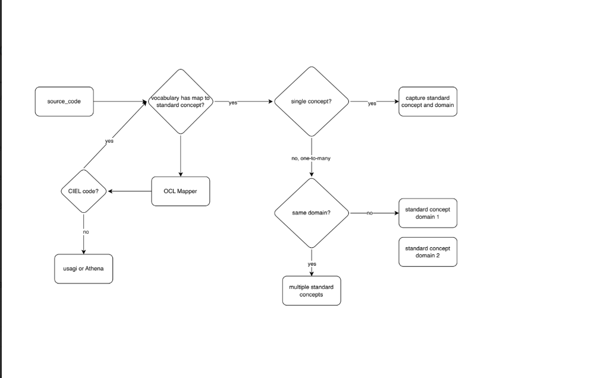
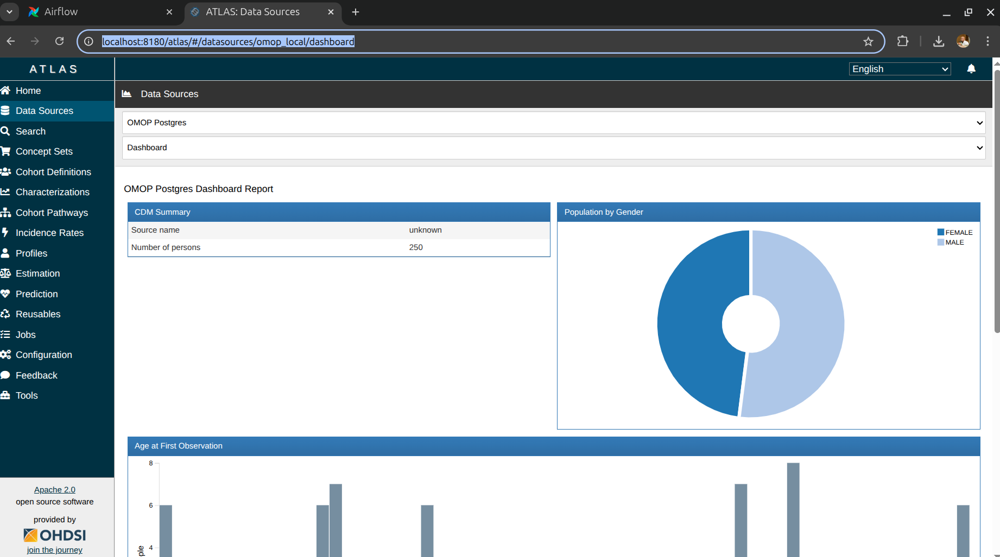
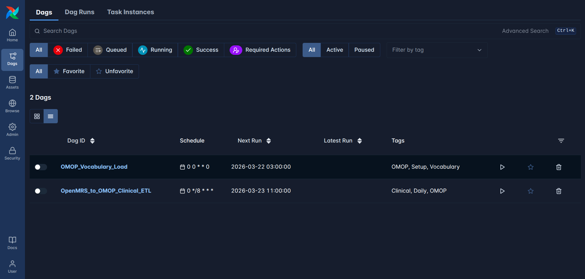
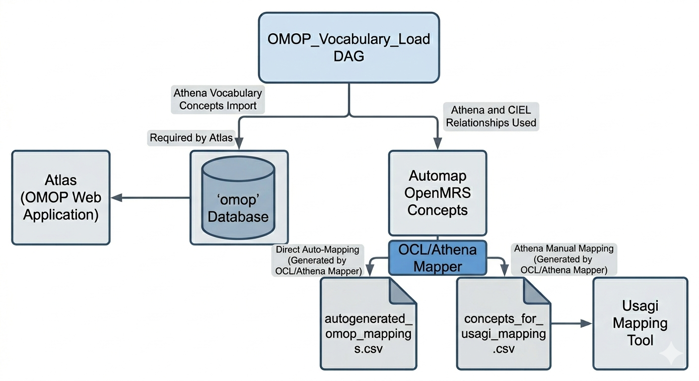

# 🌍 AfricaWG: OpenMRS to OMOP CDM ETL Pipeline

This repository contains the tools and orchestration logic to transform **OpenMRS data** into the **OMOP Common Data Model (CDM) v5.4** using **SQLMesh** and **Apache Airflow**.

## Data Integration & ETL Architecture
The following diagram illustrates the end-to-end ETL workflow implemented in this repository, detailing the pipeline from OpenMRS source data to the OMOP Common Data Model (CDM).


---

## What You'll Need Before Starting

- **Docker Desktop** installed on your computer ([Download here](https://www.docker.com/products/docker-desktop/))
- **Basic command line knowledge** (we'll show you the exact commands to type)
- About **30 minutes** for the initial setup


#### Installing Docker

<details>
<summary>mac OS</summary>


1. **Manual Installation:**
  - Download Docker Desktop from [https://www.docker.com/products/docker-desktop](https://www.docker.com/products/docker-desktop)
  - Install and launch Docker Desktop
  - Ensure Docker is running (you should see the Docker icon in your menu bar)
2. Or ** Using Homebrew:**
   ```bash
   brew install --cask docker
   ```
   Then launch Docker Desktop from Applications.
</details>

<details>
<summary>Windows</summary>

1. Download Docker Desktop from [https://www.docker.com/products/docker-desktop](https://www.docker.com/products/docker-desktop)
2. Install and launch Docker Desktop
3. Ensure WSL 2 is enabled if prompted
</details>

<details>
<summary>Linux (Ubuntu/Debian)</summary>


```bash
# Update package index
sudo apt-get update

# Install prerequisites
sudo apt-get install apt-transport-https ca-certificates curl gnupg lsb-release

# Add Docker's official GPG key
curl -fsSL https://download.docker.com/linux/ubuntu/gpg | sudo gpg --dearmor -o /usr/share/keyrings/docker-archive-keyring.gpg

# Add Docker repository
echo "deb [arch=amd64 signed-by=/usr/share/keyrings/docker-archive-keyring.gpg] https://download.docker.com/linux/ubuntu $(lsb_release -cs) stable" | sudo tee /etc/apt/sources.list.d/docker.list > /dev/null

# Install Docker
sudo apt-get update
sudo apt-get install docker-ce docker-ce-cli containerd.io

# Start Docker service
sudo systemctl start docker
sudo systemctl enable docker

# Add your user to docker group (optional, to avoid sudo)
sudo usermod -aG docker $USER
```

</details>


## 🚀 Getting Started

---

## 1. Database Initialization
Before building the containers, you must provide the initial data dump for the OpenMRS database.
- Action: Locate your `db.sql `file
- Path: Move or upload the db.sql file into the `./omrs-db/` directory
- Note: The Docker container is configured to automatically execute any .sql scripts found in this folder during the first boot.

### 2. Build the Required Docker Images
Once the SQL dump is in place, build the environment using Docker Compose. This ensures all configurations and the database dump are baked into the initial volume setup.

```bash
sudo docker compose --profile manual build
```
**What this does:** Downloads and sets up all the databases and tools you'll need.

---

### 3. Start the Services

```bash
sudo docker compose up -d
```
**What this does:** Starts all the services including databases and web interfaces.

**✅ Success indicator:** You'll see messages saying services are ready. The process is complete when you stop seeing new log messages.

---


## What's Now Available?

After running the setup, you'll have access to:

- **CloudBeaver** (Database viewer): http://localhost:8978
- **OMOP PostgreSQL Database**: Available at localhost:5433
- **MySQL Database**: Contains OpenMRS DB and available internally for quick previews

---

## Working with Your Data

### Understanding the Database Setup

You now have three main databases:
- **PostgreSQL** (omop-db): Your final OMOP-formatted data lives here
- **MySQL** (sqlmesh-db): Contains two databases:
  - `openmrs`: Your source OpenMRS dataset with 250 patients
  - `omop_db`: Used for quick previews and intermediate processing

### Viewing Your Data with CloudBeaver

CloudBeaver is a web-based tool that lets you explore your databases without needing to install additional software.

#### First Time Setup (Only do this once)

1. **Open CloudBeaver**: Go to http://localhost:8978 in your web browser

2. **Create Your Admin Account** (First time only):
  - You'll see a Setup Wizard
  - Choose any username (suggestion: `super_user`)
  - Choose any password (suggestion: `Admin@123` - remember this!)
  - Click through to complete the setup
  - Log in with these credentials

#### Connect to Your Databases

**Connect to PostgreSQL (Your main OMOP database):**

1. Click **"New Connection"** from the top menu
2. Select **"PostgreSQL"** from the list
3. Fill in these exact details:
  - **Host**: `omop-db`
  - **Port**: `5432`
  - **Database**: `postgres`
  - **Username**: `postgres`
  - **Password**: `postgres_pass`
4. Click **"Test Connection"** to make sure it works
5. Click **"Create"**

**Connect to MySQL (For source data and previews):**

1. Click **"New Connection"** again
2. Select **"MariaDB"** from the list
3. Fill in these exact details:
  - **Host**: `sqlmesh-db`
  - **Port**: `3306`
  - **Database**: *(leave empty)*
  - **Username**: `root`
  - **Password**: `openmrs`
4. Click **"Create"**

**Important:** Once connected, you'll see two databases:
- `openmrs`: Your source data with 250 patients
- `omop_db`: Preview results from your transformations (available only when you run the pipeline at least once)

---

### Option B: Manual CLI Execution
For development or step-by-step debugging, you can run the ETL directly using the core service.

**You have two choices for running Manual CLI Execution.**
### Option B.1: The "One-Click" Pipeline (Recommended)
This executes all 11 internal steps in the correct sequence automatically.
```bash
sudo docker compose run --rm core run-full-pipeline
```
### Option B.2: Manual Step-by-Step Execution
Use this if you need to debug a specific stage or are working in a development environment.

| Step | Command                                                               | Description                                                                 |
|-----|-----------------------------------------------------------------------|-----------------------------------------------------------------------------|
| 1   | `sudo docker compose run --rm core generate-mapper-placeholder-files` | Prepares initial mapping logic files                                        |
| 4   | `sudo docker compose run --rm core sync-omrs-mappings`                | Syncs your mapping.csv with the ETL engine                                  |
|     | [Go to Section 6.0: Usagi Mapping]                                    | Perform your concept mapping now then come back and run the remaining steps |
| 7   | `sudo docker compose run --rm core apply-sqlmesh-plan`                | Runs SQLMesh transformations on the data                                    |
| 8   | `sudo docker compose run --rm core materialize-mysql-views `          | Converts logic views into physical tables                                   |
| 9   | `sudo docker compose run --rm core migrate-to-postgresql  `           | Moves data from MySQL to the final Postgres DB                              |
| 11  | `sudo docker compose run --rm core generate_mapping_report `          | Outputs a coverage report of your mappings                                  |

---


## 🧠 6.0 Mapping OpenMRS Concepts (Usagi)

After running Step 4 (CLI) or the Vocabulary Load (Airflow), the required mapping input is automatically generated.

✅ **Input File Location:**

```
/concepts/concepts_for_usagi_mapping.csv
```

You'll import this file into **Usagi** to map your OpenMRS concepts to OMOP standard concepts.

---

### 6.1. Import the File into Usagi

##### a. Download and Install Usagi

If you don't have Usagi installed yet:

- Go to the official OHDSI page for Usagi:
  [https://ohdsi.github.io/Usagi/](https://ohdsi.github.io/Usagi/)
- Download the latest release suitable for your operating system.
- Extract and run Usagi.

---

##### b. Import the OMOP Vocabulary

Before you can map your concepts, you must load the OMOP vocabulary into Usagi.

- Download the vocabulary files (e.g. `CONCEPT.csv`, `VOCABULARY.csv`, etc.) from [OHDSI Athena](https://athena.ohdsi.org/).
- In Usagi, go to:

```
File > Import Vocabulary
```

- Select the folder containing Athena vocabulary CSV files.

> **Note:** This is a one-time task unless you update your vocabularies in the future.

---

##### c. Import the Concepts for Mapping

- In Usagi, go to:

```
File > Import Codes
```

- Select the file that was automatically generated by one of docker cmds:

```
/concepts/concepts_for_usagi_mapping.csv
```

Usagi will automatically attempt to map your source concepts to standard OMOP concepts based on the concept names and frequencies.

---

##### d. Review and Save the Mapping

- Review the suggested mappings:
    - Approve mappings
    - Change mappings
    - Or leave some unmapped for later

- Once you're done, save the mapping:


```
File > Save As
```

- Save the file in the `concepts` folder and name it:

```
mapping.csv
```

**Location of saved mapping file:**

```
/concepts/mapping.csv
```

---

##### e. Updating Your Mapping Later

If you wish to change mappings in the future:

- Open Usagi
- Go to:

```
File > Apply Previous Mapping
```

- Import your existing mapping file (`mapping.csv`), and make further edits as needed.

## 🔄 6.2 Re-run the Mapping Orchestration

Now that `mapping.csv` is populated, re-run the pipeline to apply the clinical transformation.
 - If using Airflow: Trigger the `OpenMRS_to_OMOP_Clinical_ETL` DAG.
 - If using Manual CLI: Continue with Step 5 in the Manual Step-by-Step table, or run the `run-full-pipeline` command.
---

## 📊 7.0 Data Characterization & Quality Checks

### Run Achilles

```bash
sudo docker compose run --rm achilles Rscript /opt/achilles/entrypoint.r
```

### **Run DQD to perform data quality checks**

```bash
sudo docker compose run --rm dqd Rscript /opt/dqd/run_dqd.R run
```
This runs the [OHDSI Data Quality Dashboard (DQD)](https://github.com/OHDSI/DataQualityDashboard) on the OMOP database.


### View the Data Quality Dashboard

```bash
sudo docker compose --profile manual up -d dqd-viewer
```
**This serves** the DQD results on a local web server. Once it's running, open your browser and go to http://localhost:3000.

---

## 📈 8.0 Cohort Analysis & Exploration (ATLAS)
Once your data is loaded into OMOP CDM and validated, you can explore it using OHDSI ATLAS.

### 8.1 Start ATLAS
```bash
sudo docker compose -f docker-compose.atlas.yml up -d
```
## 8.2 Access ATLAS

```bash
 http://localhost:8180/atlas
```

---
## 8.3 Atlas Preview 




# 🌀 5.0 Run Orchestration

You have two options to run the data conversion:

## Option A: Production Orchestration (Airflow)


Use **Apache Airflow** to visually monitor and schedule your pipeline.

### 1. Environment Setup

```bash
chmod +x ./airflow/airflow_env_generator.sh && ./airflow/airflow_env_generator.sh
```

### 2. Launch Airflow

```bash
sudo docker compose --env-file .env-airflow -f docker-compose.airflow.yml up -d
```

- UI URL: http://localhost:8780
- Credentials: username: `airflow` password: `airflow`



### 3. Trigger Setup DAG:
Run `OMOP_Vocabulary_Load`.

This DAG manages the end-to-end ingestion and semantic mapping of medical vocabularies. It executes the following core processes:

- Athena Vocabulary Ingestion: Performs a bulk import of Athena vocabulary concepts into the `omop` database. This provides the necessary underlying structure for Atlas to function.
- Semantic Mapping Workflow: Processes source codes through a decision logic (as seen in the workflow diagram at the start of readme) to determine the best OMOP Standard Concept.
- OCL/Athena Mapper Integration: For codes identified as CIEL or those lacking immediate standard maps, the OCL/Athena Mapper is engaged. It cross-references OCL and Athena relationships to resolve mappings, resulting in two distinct output files:

    - `autogenerated_omop_mappings.csv`: Contains automated maps for direct implementation.
    - `concepts_for_usagi_mapping.csv`: Contains concepts that require human-in-the-loop validation via the Usagi tool or manual Athena lookup.



### 4. Next Step:
Proceed to Section 6.0 (Mapping) before running clinical DAG.

---
