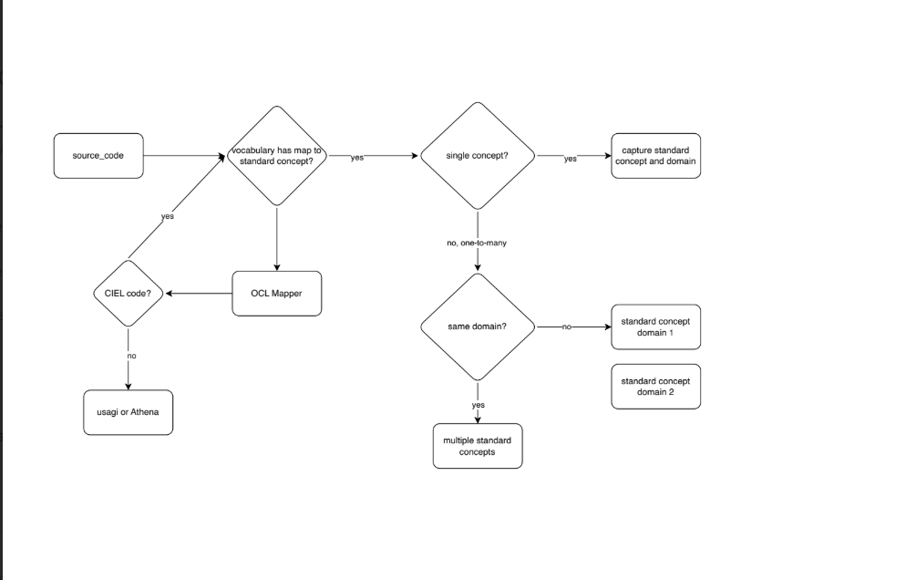
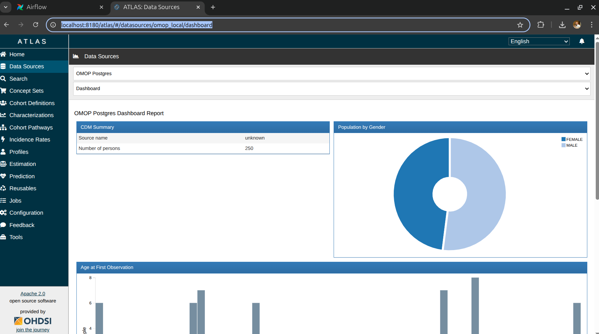

# 🌍 AfricaWG: OpenMRS to OMOP CDM ETL Pipeline

This repository contains the tools and orchestration logic to transform **OpenMRS data** into the **OMOP Common Data
Model (CDM) v5.4** using **SQLMesh** and **Apache Airflow**.

## Data Integration & ETL Architecture

The following diagram illustrates the end-to-end ETL workflow implemented in this repository, detailing the pipeline
from OpenMRS source data to the OMOP Common Data Model (CDM).


---

## What You'll Need Before Starting

- **Docker Desktop** installed on your computer ([Download here](https://www.docker.com/products/docker-desktop/))
- **Basic command line knowledge** (we'll show you the exact commands to type)
- About **30 minutes** for the initial setup

#### Installing Docker

<details>
<summary>mac OS</summary>

1. **Manual Installation:**

- Download Docker Desktop
  from [https://www.docker.com/products/docker-desktop](https://www.docker.com/products/docker-desktop)
- Install and launch Docker Desktop
- Ensure Docker is running (you should see the Docker icon in your menu bar)

2. Or ** Using Homebrew:**
   ```bash
   brew install --cask docker
   ```
   Then launch Docker Desktop from Applications.

</details>

<details>
<summary>Windows</summary>

1. Download Docker Desktop
   from [https://www.docker.com/products/docker-desktop](https://www.docker.com/products/docker-desktop)
2. Install and launch Docker Desktop
3. Ensure WSL 2 is enabled if prompted

</details>

<details>
<summary>Linux (Ubuntu/Debian)</summary>

```bash
# Update package index
sudo apt-get update

# Install prerequisites
sudo apt-get install apt-transport-https ca-certificates curl gnupg lsb-release

# Add Docker's official GPG key
curl -fsSL https://download.docker.com/linux/ubuntu/gpg | sudo gpg --dearmor -o /usr/share/keyrings/docker-archive-keyring.gpg

# Add Docker repository
echo "deb [arch=amd64 signed-by=/usr/share/keyrings/docker-archive-keyring.gpg] https://download.docker.com/linux/ubuntu $(lsb_release -cs) stable" | sudo tee /etc/apt/sources.list.d/docker.list > /dev/null

# Install Docker
sudo apt-get update
sudo apt-get install docker-ce docker-ce-cli containerd.io

# Start Docker service
sudo systemctl start docker
sudo systemctl enable docker

# Add your user to docker group (optional, to avoid sudo)
sudo usermod -aG docker $USER
```

</details>

## 🚀 Getting Started

---

## 1. 🛠️ Deployment

<details>

<summary>Option 1: Run with OpenMRS SQL Dump Dataset</summary>

You must provide a SQL dump file from the existing OpenMRS instance at the facility or hospital.

1. Extract the database dump
    - Export the database from the SQL Server/MySQL instance.
    - Rename the exported file to: db.sql
2. Place the dump in the correct directory
    - Move or upload db.sql into the following directory
      `./omrs-db/`
    - If a file already exists there, replace/overwrite it.
3. For testing purposes
    - If you do not have access to an existing OpenMRS instance, you may use the default sample dump:
      `db.sql`

### To import the SQL dump or the source data into the mysql docker container Run:

```bash
sudo docker compose --profile sqlmesh-db up -d
```

</details>

<details>
<summary> Option 2: Run with OpenMRS Instance</summary>

If you want to have an OpenMRS instance up and running alongside the ETL pipeline,

### To start with OpenMRS:

```bash
sudo docker compose -f docker-compose.yml -f docker-compose.openmrs.yml up -d
```

</details>

### 2. Build the ETL Core Docker Images

The **core service** contains all SQLMesh models required for the ETL pipeline. You must build these images before
running any ETL jobs.

```bash
sudo docker compose --profile default --profile core build
```

---

### 3. Start the Services including the target omop db containers

```bash
sudo docker compose --profile default up -d
```

**What this does:** Starts all the services including databases and web interfaces.

---

## What's Now Available?

After running the setup, you'll have access to:

- **CloudBeaver** (Database viewer): http://localhost:8978
- **OMOP PostgreSQL Database**: Available at localhost:5433
- **MySQL Database**: Contains OpenMRS DB and available internally for quick previews

---

## Working with Your Data

### Understanding the Database Setup

You now have three main databases:

- **PostgreSQL** (omop-db): Your final OMOP-formatted data lives here
- **MySQL HOST** (sqlmesh-db OR  omrsdb): Contains two databases:
    - `openmrs`: Your source OpenMRS dataset with 250 patients
    - `omop_db`: Used for quick previews and intermediate processing

### Viewing Your Data with CloudBeaver

CloudBeaver is a web-based tool that lets you explore your databases without needing to install additional software.

#### First Time Setup (Only do this once)

1. **Open CloudBeaver**: Go to http://localhost:8978 in your web browser

2. **Create Your Admin Account** (First time only):

- You'll see a Setup Wizard
- Choose any username (suggestion: `super_user`)
- Choose any password (suggestion: `Admin@123` - remember this!)
- Click through to complete the setup
- Log in with these credentials

#### Connect to Your Databases

**Connect to PostgreSQL (Your main OMOP database):**

1. Click **"New Connection"** from the top menu
2. Select **"PostgreSQL"** from the list
3. Fill in these exact details:

- **Host**: `omop-db`
- **Port**: `5432`
- **Database**: `postgres`
- **Username**: `postgres`
- **Password**: `postgres_pass`

4. Click **"Test Connection"** to make sure it works
5. Click **"Create"**

**Connect to MySQL (For source data and previews):**

1. Click **"New Connection"** again
2. Select **"MariaDB"** from the list
3. Fill in these exact details:

- **Host**: `sqlmesh-db` or `omrsdb`
- **Port**: `3306` or `3307`
- **Database**: *(leave empty)*
- **Username**: `root`
- **Password**: `openmrs`

4. Click **"Create"**

**Important:** Once connected, you'll see two databases:

- `openmrs`: Your source data with 250 patients
- `omop_db`: Preview results from your transformations (available only when you run the pipeline at least once)

---

## 4. ETL Step-by-Step Execution commands
**Please Note:** You can either use Openmrs dump Dataset located at `omrs-db`  Or Openmrs Instance which comes with its own Synthetic dataset

| Step | Openmrs Dataset SQL Dump ETL Commands                                                                         | Openmrs Instance ETL Commands                                                                                     | Description                                                                 |
|------|---------------------------------------------------------------------------------------------------------------|-------------------------------------------------------------------------------------------------------------------|-----------------------------------------------------------------------------|
| 4.1  | ``sudo docker compose --profile default run --rm core generate-mapper-placeholder-files`` | ``sudo docker compose --profile default run --rm core generate-mapper-placeholder-files``                         | Prepares initial mapping logic files                                        |
| 4.2  | `sudo docker compose --profile default  run --rm --env MYSQL_PORT=3306 core sync-omrs-mappings`                                    | `sudo docker compose --profile default  run --rm --env SQLMESH_DB=omrsdb MYSQL_PORT=3307 core sync-omrs-mappings` | Syncs your concept_mapping_usagi_extract.csv with the ETL engine            |
|      | [Go to Section 5 : Usagi Mapping]                                                                             | [Go to Section 6.0: Usagi Mapping]                                                                                | Perform your concept mapping now then come back and run the remaining steps |
| 4.3  | `sudo docker compose run --rm core apply-sqlmesh-plan`                                                        | `sudo SQLMESH_DB=omrsdb MYSQL_PORT=3307 docker compose run --rm core apply-sqlmesh-plan`                          | Runs SQLMesh transformations on the data                                    |
| 4.4  | `sudo docker compose run --rm --env MYSQL_PORT=3306 core materialize-mysql-views`                                                  | `sudo SQLMESH_DB=omrsdb MYSQL_PORT=3307 docker compose run --rm core materialize-mysql-views`                     | Converts logic views into physical tables                                   |
| 4.5  | `sudo docker compose run --rm core migrate-to-postgresql`                                                     | `sudo SQLMESH_DB=omrsdb MYSQL_PORT=3307 docker compose run --rm core migrate-to-postgresql`                                      | Moves data from MySQL to the final Postgres DB                              |
| 4.6  | `sudo docker compose run --rm core generate_mapping_report`                                                   | `sudo docker compose run --rm core generate_mapping_report`                                                       | Outputs a coverage report of your mappings                                  |

---

## 🧠 5. Mapping OpenMRS Concepts (Usagi)

After running Step 4 (CLI) or the Vocabulary Load (Airflow), the required mapping input is automatically generated.

✅ **Input File Location:**

```
/concepts/concepts_for_usagi_mapping.csv
```

You'll import this file into **Usagi** to map your OpenMRS concepts to OMOP standard concepts.

---

### 5.1. Import the File into Usagi

##### a. Download and Install Usagi

If you don't have Usagi installed yet:

- Go to the official OHDSI page for Usagi:
  [https://ohdsi.github.io/Usagi/](https://ohdsi.github.io/Usagi/)
- Download the latest release suitable for your operating system.
- Extract and run Usagi.

---

##### b. Import the OMOP Vocabulary

Before you can map your concepts, you must load the OMOP vocabulary into Usagi.

- Download the vocabulary files (e.g. `CONCEPT.csv`, `VOCABULARY.csv`, etc.)
  from [OHDSI Athena](https://athena.ohdsi.org/).
- In Usagi, go to:

```
File > Import Vocabulary
```

- Select the folder containing Athena vocabulary CSV files.

> **Note:** This is a one-time task unless you update your vocabularies in the future.

---

##### c. Import the Concepts for Mapping

- In Usagi, go to:

```
File > Import Codes
```

- Select the file that was automatically generated by one of docker cmds:

```
/concepts/concepts_for_usagi_mapping.csv
```

Usagi will automatically attempt to map your source concepts to standard OMOP concepts based on the concept names and
frequencies.

---

##### d. Review and Save the Mapping

- Review the suggested mappings:
    - Approve mappings
    - Change mappings
    - Or leave some unmapped for later

- Once you're done, save the mapping:


```
File > Save As
```

- Save the file in the `concepts` folder and name it:

```
concept_mapping_usagi_extract.csv
```

**Location of saved mapping file:**

```
/concepts/concept_mapping_usagi_extract.csv
```

---

##### e. Updating Your Mapping Later

If you wish to change mappings in the future:

- Open Usagi
- Go to:

```
File > Apply Previous Mapping
```

- Import your existing mapping file (`concept_mapping_usagi_extract.csv`), and make further edits as needed.


**✅ After Successful Mapping with Usagi:** Please go back to section 4.3 of the ETL Orchestration commands

---

## 📊 6.0 Data Characterization & Quality Checks

### 6.1 Run Achilles

```bash
sudo docker compose --profile cdm-postprocessing run --rm achilles Rscript /opt/achilles/entrypoint.r
```

### 6.2 **Run DQD to perform data quality checks**

```bash
sudo docker compose run --rm dqd Rscript /opt/dqd/run_dqd.R run
```

This runs the [OHDSI Data Quality Dashboard (DQD)](https://github.com/OHDSI/DataQualityDashboard) on the OMOP database.

### 6.3 View the Data Quality Dashboard

```bash
sudo docker compose --profile manual up -d dqd-viewer
```

**This serves** the DQD results on a local web server. Once it's running, open your browser and go
to http://localhost:3000.

---

## 📈 7.0 Cohort Analysis & Exploration (ATLAS)

Once your data is loaded into OMOP CDM and validated, you can explore it using OHDSI ATLAS.

### 7.1 Start ATLAS

```bash
sudo docker compose --env-file ./atlas/.env -f docker-compose.atlas.yml up -d
```

## 7.2 Access ATLAS

```bash
 http://localhost:8180/atlas
```

---

## 7.3 Atlas Preview

