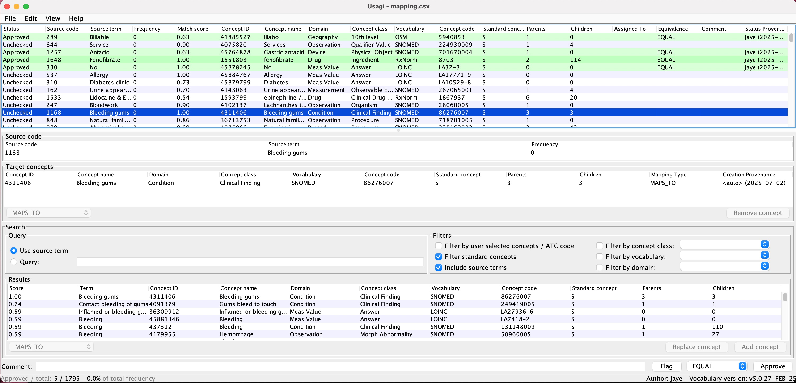
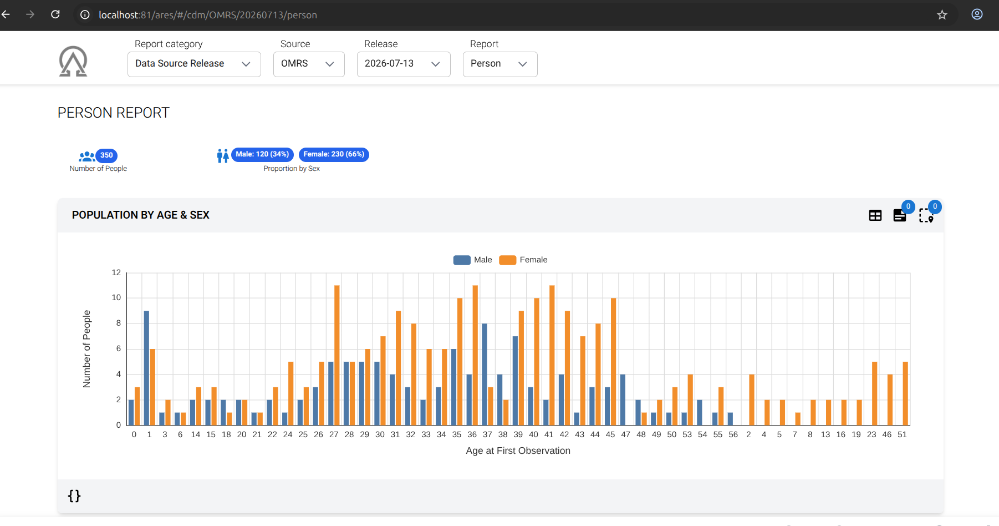

# OMOP ETL Deep Dive - Getting Started Guide

This project helps you transform healthcare data from OpenMRS into the OMOP Common Data Model format using **SQLMesh** as the transformation engine.

## 📹 Session Recording

This entire setup and workflow was covered in our previous call. You can watch the full recording here:
**[OHDSI Africa Chapter - OMOP ETL Deep Dive Session](https://drive.google.com/file/d/1Ew2O4O8-GIYwnIU76tOPYQGcs5BQMfpk/view?usp=drive_link)**

Here is the link to the github repository with the guided steps:
https://github.com/abertnamanya/openmrs-350-patients-dataset
## Your Goal

We've already mapped two entities during the call (**Location** and **Person**) - you can find these examples in the `core/models` folder. Your task is to **map the remaining OMOP entities** using these as reference templates.

**Dataset Info:** You'll be working with a sample OpenMRS database containing **350 patients** to practice your transformations.


## Quick Start (3 Simple Steps)

### Step 1: Get the Project Files
ETL executions files will be downloaded onto you're PC/MAC
```bash
git clone --branch omop-deep-dive --single-branch https://github.com/OHDSI/AfricaWG.git
cd AfricaWG
```

### Step 2: Build the Project

This step prepares all the necessary software components. It may take 5-10 minutes the first time.

```bash
docker compose build
```

**What this does:** Downloads and sets up all the databases and tools you'll need.

### Step 3: Start Everything

```bash
docker compose up -d
```

**What this does:** Starts all the services including databases and web interfaces.

---

## Working with Your Data

### Understanding the Database Setup

You now have three main databases:
- **PostgreSQL** (omop-db): Your final OMOP-formatted data lives here
- **MySQL** (sqlmesh-db): Contains two databases:
    - `openmrs`: Your source OpenMRS dataset with 350 patients
    - `omop_db`: Used for quick previews and intermediate processing

### Viewing Your Data with CloudBeaver

CloudBeaver is a web-based tool that lets you explore your databases without needing to install additional software.

#### First Time Setup (Only do this once)

1. **Open CloudBeaver**: Go to http://localhost:8978 in your web browser

2. **Create Your Admin Account** (First time only):
    - You'll see a Setup Wizard
    - Choose any username (suggestion: `superuser`)
    - Choose any password (suggestion: `Admin@123` - remember this!)
    - Click through to complete the setup
    - Log in with these credentials

#### Connect to Your Databases

**Connect to PostgreSQL (Your main OMOP database):**

1. Click **"New Connection"** from the top menu
2. Select **"PostgreSQL"** from the list
3. Fill in these exact details:
    - **Host**: `omop-db`
    - **Port**: `5432`
    - **Database**: `postgres`
    - **Username**: `postgres`
    - **Password**: `postgres_pass`
4. Click **"Test Connection"** to make sure it works
5. Click **"Create"**

**Connect to MySQL (For source data and previews):**

1. Click **"New Connection"** again
2. Select **"MySQL"** from the list
3. Fill in these exact details:
    - **Host**: `sqlmesh-db`
    - **Port**: `3306`
    - **Database**: *(leave empty)*
    - **Username**: `root`
    - **Password**: `openmrs`
4. Click **"Create"**

**Important:** Once connected, you'll see two databases:
- `openmrs`: Your source data with 350 patients
- `omop_db`: Preview results from your transformations (available only when you run the pipeline at least once)

---

## Customizing Your Data Transformation

### Understanding SQL Models & SQLMesh

The transformation magic happens using **SQLMesh**, a powerful data transformation framework. Your transformation logic is defined in SQL files located in the `core/models` folder.

**Think of it like this:**
- Raw OpenMRS data (350 patients) goes in → SQLMesh processes your SQL models → Clean OMOP data comes out

**What's Already Done:**
- ✅ **Location** entity mapping (see `core/models/location.sql`)
- ✅ **Person** entity mapping (see `core/models/person.sql`)

**Your Task:**
- 🎯 Map the remaining OMOP entities using the existing models as templates
- Use the same patterns and structure you see in the completed examples

### Making Changes to Your Data Processing

1. **Edit SQL files** in the `core/models` directory using any text editor
2. **Test your changes** using one of the options below


## Map OpenMRS Concepts to OMOP Standard Concepts

This step involves mapping your OpenMRS concepts to OMOP standard concepts using the Usagi tool. This mapping is crucial for ensuring that your OpenMRS data is correctly transformed into the OMOP Common Data Model.

> **Note:** For your convenience, example mappings are provided in the `concepts` directory. If you're here to explore the project, you can skip this step and use the provided example mappings. This step is only required when working with a production environment or when connecting a different OpenMRS database.

---

#### Generate the Usagi Input File

Run the following command:

```bash
docker compose run --rm core generate-concepts-usagi-input
```

This will generate a CSV file containing OpenMRS concept IDs, names, and their usage frequencies.

✅ **Location of the generated file:**

```
/concepts/concepts_for_usagi_mapping
```

You'll import this file into **Usagi** to map your OpenMRS concepts to OMOP standard concepts.

---

####  Import the File into Usagi

##### a. Download and Install Usagi

If you don't have Usagi installed yet:

- Go to the official OHDSI page for Usagi:
  [https://ohdsi.github.io/Usagi/](https://ohdsi.github.io/Usagi/)
- Download the latest release suitable for your operating system.
- Extract and run Usagi.

---

##### b. Import the OMOP Vocabulary

Before you can map your concepts, you must load the OMOP vocabulary into Usagi.

- Download the vocabulary files (e.g. `CONCEPT.csv`, `VOCABULARY.csv`, etc.) from [OHDSI Athena](https://athena.ohdsi.org/).
- In Usagi, go to:

```
File > Import Vocabulary
```

- Select the folder containing the vocabulary CSV files.

> **Note:** This is a one-time task unless you update your vocabularies in the future.

---

##### c. Import the Concepts for Mapping

- In Usagi, go to:

```
File > Import Codes
```

- Select the file you generated in Step 5.1:

```
/concepts/concepts_for_usagi_mapping
```

Usagi will automatically attempt to map your source concepts to standard OMOP concepts based on the concept names and frequencies.

---

##### d. Review and Save the Mapping

- Review the suggested mappings:
   - Approve mappings
   - Change mappings
   - Or leave some unmapped for later

- Once you're done, save the mapping:


```
File > Save As
```

- Save the file in the `concepts` folder and name it:

```
mapping.csv
```

**Location of saved mapping file:**

```
/concepts/mapping.csv
```

This file will later be used by **SQLMesh** during ETL processing.

---

##### e. Updating Your Mapping Later

If you wish to change mappings in the future:

- Open Usagi
- Go to:

```
File > Apply Previous Mapping
```

- Import your existing mapping file (`mapping.csv`), and make further edits as needed.


---


### Now run ETL pipeline

Once you're happy with your preview, run the complete pipeline:

```bash
docker compose run --rm core run-pipeline
```

**What this does:**
- Runs the complete ETL process
- Creates final tables in your PostgreSQL OMOP database
- Takes longer but gives you the final production-ready data

---

## 🎉 Congratulations!

You now have a working OMOP ETL system! Your OpenMRS data is being transformed into the standard OMOP format, making it ready for research and analysis.
---

### Fancy a User Interface?

```bash
    docker compose run --rm --service-ports core sqlmesh-ui
```

Access the UI at [http://localhost:8000](http://localhost:8000)
   
 
-- 

## Fancy a Data Quality Check & Characterization

### 1. **Run Achilles to generate data summaries**
Trigger the characterization analysis via the Plumber R runner API (ensuring single-threaded execution to prevent database connection limits):
   ```bash
   curl -X POST "http://localhost:8001/run-achilles?create_indices=false&num_threads=1"
   ```

### 2. Run DQD to perform data quality checks
   Execute the OHDSI Data Quality Dashboard (DQD) checks against your OMOP database:
   ```bash
    curl -X POST "http://localhost:8001/run-dqd?cdm_version=5.4"
   ```
### 3. Generate ARES Indices
   Export and index your characterization and data quality results for web exploration:
   ```bash
   curl -X POST "http://localhost:8001/run-ares-indexer"
   ```
### 4. View the Data Quality Dashboard & ARES UI
   ARES Explorer: Access the frontend data exploration UI at
   http://localhost:81/ares/#/home.



## Cohort Analysis & Exploration (ATLAS)
Once your data is loaded into OMOP CDM and validated, you can explore it using OHDSI ATLAS.


```
sudo docker compose --env-file ./atlas/.env -f docker-compose.atlas.yml up -d
```
## Access ATLAS
```
 http://localhost:8180/atlas
```